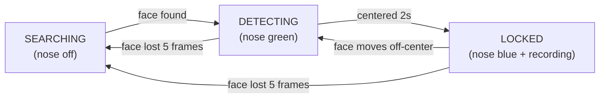

# Face Tracking with LED States & Voice Recording

## Changes Made

Modified [PiFaceFast.py](file:///Users/russellreid/Downloads/ECE492/qbo_gitlab/QBO/PiFaceFast.py) to add a 3-state face tracking system:

### State Machine

| State | Nose LED | Behavior |
|-------|----------|----------|
| **SEARCHING** | Off | No face detected, head returns home after 10s |
| **DETECTING** | 🟢 Green | Face visible, servos tracking, waiting for center lock |
| **LOCKED** | 🔵 Blue | Face centered ≥2s, recording voice via `arecord -D dmicQBO_sv` |

### State Transitions

### Key Code Additions

- **[State variables](file:///Users/russellreid/Downloads/ECE492/qbo_gitlab/QBO/PiFaceFast.py#L181-L191)**: `TRACK_SEARCHING`, `TRACK_DETECTING`, `TRACK_LOCKED` constants and tracking state
- **[start_voice_recording()](file:///Users/russellreid/Downloads/ECE492/qbo_gitlab/QBO/PiFaceFast.py#L194-L206)**: Launches `arecord -D dmicQBO_sv` subprocess, saves to `/opt/qbo/recordings/voice_YYYYMMDD_HHMMSS.wav`
- **[stop_voice_recording()](file:///Users/russellreid/Downloads/ECE492/qbo_gitlab/QBO/PiFaceFast.py#L209-L219)**: Terminates recording subprocess cleanly
- **[State machine logic](file:///Users/russellreid/Downloads/ECE492/qbo_gitlab/QBO/PiFaceFast.py#L630-L748)**: Replaces the old nose color logic with the new SEARCHING→DETECTING→LOCKED flow

### What's Preserved
- ✅ Hotword listener (openWakeWord) stays active
- ✅ All assistant integrations (Watson, Dialogflow, Google Assistant)
- ✅ Servo tracking with EMA smoothing and speed caps
- ✅ Face recognition greeting ([greet_face_async](file:///Users/russellreid/Downloads/ECE492/qbo_gitlab/QBO/PiFaceFast.py#345-406))
- ✅ Touch sensor handling

## Testing

Deploy to the robot and run `python3 PiFaceFast.py`:

1. Stand in front of camera → nose turns **green**, head tracks
2. Hold still ~2s → nose turns **blue**, check `/opt/qbo/recordings/` for `.wav` file
3. Walk away → nose turns **off**, recording stops
4. Playback: `aplay /opt/qbo/recordings/voice_*.wav`
